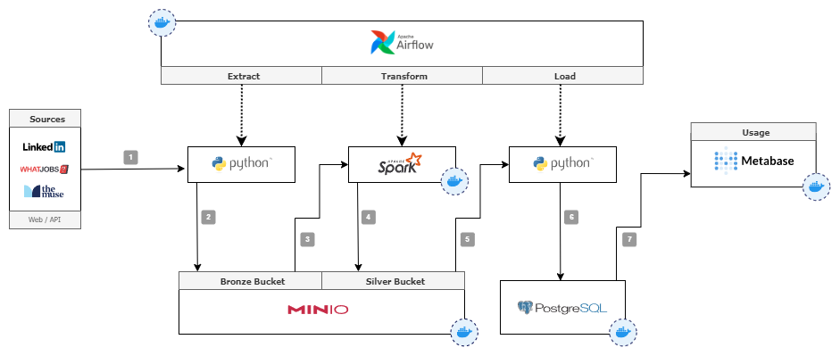

## Introduction
This project originated as a capstone showcase of the skills and knowledge acquired during the [DataScientest](https://github.com/DataScientest) Bootcamp. Initially designed to demonstrate our ability to apply data engineering principles in a structured educational setting, it has since evolved into a more practical, real-world application.

## Purpose and Objectives
The core objective of this project has shifted towards developing a comprehensive tool/system aimed at monitoring job listings related to specific fields or keywords. By refining our focus, the tool now aims to provide valuable insights into market trends, particularly highlighting how tech stacks and job requirements evolve over time in relation to specific professions.

## Main Features
The main functionalities of this tool include:
- **Job Listing Monitoring**: Continuous tracking of new job postings across various platforms, filtering based on user-defined criteria such as keywords or locations.
- **Keyword Analysis**: In-depth analysis of job descriptions, identifying and extracting key terms and skills to gauge market demand.
- **Trend Insights**: Generating reports and visualizations that represent current trends and shifts in the technology landscape within the job market.

## Potential Benefits and Applications
This tool is particularly beneficial for job seekers, career advisors, and market analysts, providing them with the ability to stay updated with the latest market demands and job requirements. It serves as a valuable resource for understanding which skills are rising in demand and how the employment landscape is evolving, especially in the tech industry.

## Conclusion and Outlook
Currently, the tool stands as a robust solution for monitoring and analyzing job market trends. Moving forward, we aim to expand its capabilities, incorporating more advanced data analysis features and broader job market coverage. Our goal is to create a versatile platform that can cater to a wider audience, offering deeper insights and more personalized job market information.

## Technology and Environment Requirements

This project employs a combination of technologies each designated for specific roles within our data engineering pipeline:

- **Docker Compose**: Used for container management, orchestrating our network of services seamlessly.
- **MinIO S3**: Acts as an object storage solution, akin to Amazon S3, used for storing raw data in the 'bronze' bucket following the initial scraping process.
- **Airflow**: Manages the orchestration of tasks, ensuring each source has its separate Directed Acyclic Graph (DAG) for systematic processing.
- **Spark**: Utilized for data transformation tasks, although it's acknowledged that Spark's capabilities might be underutilized given the current scale of data.
- **PostgreSQL**: Serves as the Data Warehouse where transformed data is stored for analytics and reporting.
- **TODO: MLFlow**: Intended for managing ML models, although this component is yet to be implemented.
- **pgAdmin**: A web-based administration tool for managing PostgreSQL databases, enhancing database management and monitoring capabilities within the project environment.

The workflow begins with scraping web pages using BeautifulSoup, a process not on the same technology scale as others but critical for raw data acquisition. These raw data are then stored in the MinIO 'bronze' bucket as CSV files. Subsequently, Airflow triggers tasks where PySpark transforms this raw data into the desired format and stores it in the 'silver' bucket as both delta and CSV. Finally, the transformed data are loaded into the PostgreSQL database.

It is important to note that while Spark and Delta storage represent over-engineering for the current data volume of this project, their inclusion serves educational purposes, reflecting the learning nature of this project.

## System Architecture

The architecture diagram below illustrates the overall structure and interactions between the different components of our system. This includes how data flows from the initial sources through to the final storage and analysis stages.

### Short Description of Data Flow (per DAG)
1. Scrape data from a single source based on defined keywords and locations.
2. Save the results for each combination of location and keyword as CSV files into the 'bronze' bucket.
3. Load data from the latest batch and apply transformations.
4. Save the transformed data for each Dimension and Fact Table in separate CSV files (and in Delta formats).
5. Load all Dimension Tables into PostgreSQL, retrieve IDs, and use them to populate the Fact Table.
6. Load the Fact Table into PostgreSQL, retrieve IDs, and use them to populate Bridge Tables.
7. Load Bridge Tables into PostgreSQL.

## Getting Started

### Prerequisites
Before setting up the project, ensure your system meets the following requirements:
- At least 8 GB of RAM
- A stable internet connection

Note: To simplify Docker Compose commands, we make use of Makefile, which is a Linux COMPLETE THIS.

### Make Commands and Docker Compose Equivalents
To facilitate the management of the project's Docker containers, we use Make commands. Below is a table of the commonly used Make commands and their corresponding Docker Compose commands:

| Make Command         | Docker Compose Command                                           |
|----------------------|------------------------------------------------------------------|
| `make run`           | `docker-compose up -d minio spark-master spark-worker airflow-webserver airflow-scheduler airflow-worker postgres pgadmin` |
| `make start`         | `docker-compose start`                                           |
| `make stop`          | `docker-compose stop`                                            |
| `make pull`          | `docker-compose pull`                                            |
| `make up`            | `docker-compose up -d`                                           |
| `make down`          | `docker-compose down -v`                                         |
| `make dl-jars`       | `mkdir -p ./airflow/dags/jars && sh ./airflow/download_jarfiles.sh`        |
| `make clear-images`  | `docker image prune --filter="dangling=true"`                    |
| `make airflow`       | `docker-compose up -d airflow-webserver airflow-scheduler airflow-worker` |
| `make airflow-init`          | `docker-compose up airflow-init`                                 |
| `make minio`         | `docker-compose up -d minio`                                     |
| `make minio-init`    | `docker-compose exec minio bash ./init/minio-init.sh`            |
| `make spark`         | `docker-compose up -d spark-master && sleep 5 && docker-compose up -d spark-worker` |
| `make spark-scale`   | `docker-compose up --scale spark-worker=3 -d`                    |
| `make spark-worker-restart` | `docker-compose restart spark-worker`                           |
| `make postgres`   | `docker-compose up -d postgres`                                  |
| `make pgadmin`       | `docker-compose up -d pgadmin`                                   |
| `make mariadb-exec`  | `docker-compose exec mariadb mysql -u root -p -h localhost`      |

Utilize these commands as needed for starting, stopping, and managing the project containers and services.

### Installation and Setup
Follow these steps to set up the environment:

1. **GitHub Repo**: Clone the repository by running `git clone https://github.com/genepan2/job_listings` in the terminal.
2. **Environment Variables**: Rename `env.example` to `.env` and fill in the missing information such as usernames and passwords. For local development, defaul values are there.
3. **Docker Images**: Execute `make build` or `docker-compose build`. This may take some time.
4. **Spark Libraries**: Run `make dl_jars` to execute the `download_jarfiles.sh` script, which downloads libraries for AWS, Delta, Hadoop, MariaDB, PostgreSQL, and copies them to the `airflow\dags\jars` directory.
5. **MinIO Buckets**: For setting up MinIO, you need to create the necessary buckets. Execute the command `make minio-init` or `docker compose exec -it minio bash` to access the MinIO container. Once inside, run `sh ./init/minio-init.sh`. When prompted, enter the "Access Key" and "Secret Access Key" that you have specified in the `.env` file.

### Starting the Application
Execute the following commands to start all components:

1. `make init`
2. `make run`
3. Check if all containers are running with `make ps`

### Accessing User Interfaces
You can access the interfaces in your browser using the following URLs:

- MinIO: `http://localhost:9000` (default access: root/root12345)
- Airflow: `http://localhost:8080` (default access: airflow/airflow)
- Spark: `http://localhost:8081`
- PgAdmin: `http://localhost:8888` (default access: pgexample@example.com/pass12345)

All credentials can be set in the `.env` file.

### Starting DAGs in Airflow
1. Initiate the DAG for the respective source using "{SOURCE}_ETL_ML_Pipeline_v003".

## Roadmap

Below are the current objectives and planned developments for the project:

### Short-term Goals
- [ ] **Add More Sources**: Integrate additional job portals such as StepStone and Indeed.
- [ ] **Standardize Scraping Module**: Develop a unified approach for the scraping module to simplify maintenance and expansion.

### Mid-term Goals
- [ ] **Introduce Data Quality Checks**: Implement processes for checking and ensuring data quality.
- [ ] **Expand Configuration Management**: Move keywords and location data into external configuration files.
- [ ] **Develop Tests**: Create comprehensive test cases to ensure code quality and functionality.

### Long-term Goals
- [ ] **Implement DBT for Data Loading**: Use DBT (Data Build Tool) for improved data processing and loading.
- [ ] **Incorporate Machine Learning**: Set up machine learning models to predict salaries and the number of applicants.
- [ ] **Explore Alternative Data Visualization Tools**: Evaluate and integrate alternative data visualization tools for better data presentation and analysis.

## Contributions

Feel free to fork the project, create a feature branch, and submit a pull request. Ensure that your code has proper comments and passes all the existing tests.

## License

This project is licensed under the MIT License.